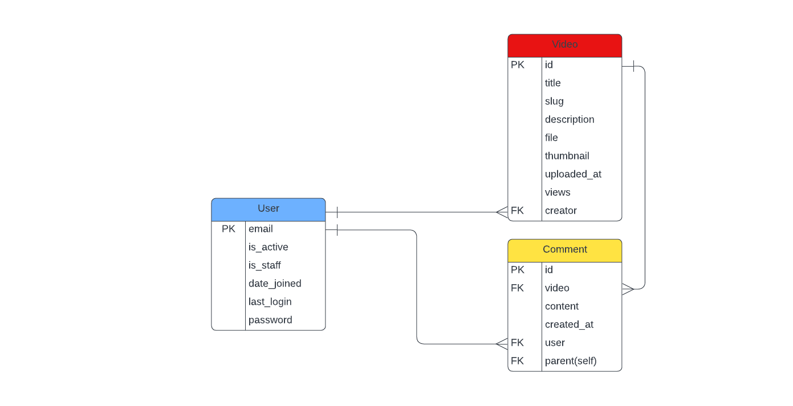

# 🎥 Video Platform Project - Stream Hive

### Business Logo:  


## 📚 Table of Contents
1. [Introduction](#-introduction)
2. [Demo](#-demo)
3. [Features](#-features)
4. [ER Diagram](#-er-diagram)
5. [Technologies Used](#technologies-used)
6. [Setup and Installation](#setup-and-installation)
7. [Usage](#usage)
8. [Contributing](#contributing)
9. [License](#license)
10. [Contact](#contact)

## 🌟 Introduction

Stream Hive is a robust web application that allows users to get access to exclusive video contents. Built with Django, this platform provides a user-friendly interface for video sharing and navigation, along with a powerful admin tools for content management.

## 📱 Demo
- Deployed link: [https://streamhive.azurewebsites.net](https://streamhive.azurewebsites.net)

## ✨ Features

- 🔐 User authentication and authorization
- 🛠️ Email verification and password reset
- 📤 Video upload and management by admin
- 🎬 Video player with basic controls
- 💬 Comment system with nested replies
- 🛠️ Admin dashboard for content moderation
- 📱 Responsive design for mobile and desktop
- 🔍 Video share functionality

## 📈 ER Diagram


## 🛠️ Technologies Used

- 🐍 Django 5.0.7
- 🐍 Python 3.12.0
- 🐘 PostgreSQL
- 🌐 HTML5, CSS3, JavaScript
- 🎨 Bootstrap 4
- 🚀 MS Azure

## 🚀 Setup and Installation

1. Clone the repository:
```bash
git clone https://github.com/simondelali/videoplatform.git
cd videoplatform
```

2. Create a virtual environment and activate it:
```
python -m venv venv
source venv/bin/activate  # On Windows, use venv\Scripts\activate
```

3. Install the required dependencies:
```
pip install -r requirements.txt
```

4. Set up the PostgreSQL database and update the `DATABASES` configuration in `settings.py`.

5. Apply migrations:
```
python manage.py migrate
```
6. Create a superuser:
```
python manage.py createsuperuser
```
7. Run the development server:
```
python manage.py runserver
```
8. Visit `http://localhost:8000` in your browser.

## 📖 Usage

1. 📝 Register a new account or log in with existing credentials.
2. 🔐 Activate your account via email confirmation.
3. 🏠 Browse videos on the video page.
4. 🎥 Watch videos and leave comments.
5. 📱 Share videos

For admin:
1. 🔐 Access the custom admin panel at `http://localhost:8000/customadmin/`
2. 📤 Upload videos through the dashboard.
3. 👤 Manage your uploaded content through the dashboard.


## 🤝 Contributing

We welcome contributions to the Share Hive Platform! Please follow these steps to contribute:

1. 🍴 Fork the repository.
2. 🌿 Create a new branch: `git checkout -b feature-branch-name`.
3. 🔧 Make your changes and commit them: `git commit -m 'Add some feature'`.
4. 📤 Push to the branch: `git push origin feature-branch-name`.
5. 🔀 Submit a pull request.

For major changes, please open an issue first to discuss what you would like to change.

## 📄 License

This project is licensed under the MIT License - see the [LICENSE](LICENSE) file for details.

## 📞 Contact

Project Link: [https://github.com/simondelali/videoplaform](https://github.com/simondelali/videoplaform)

If you have any questions, feel free to contact me at: atiegardelali@gmail.com